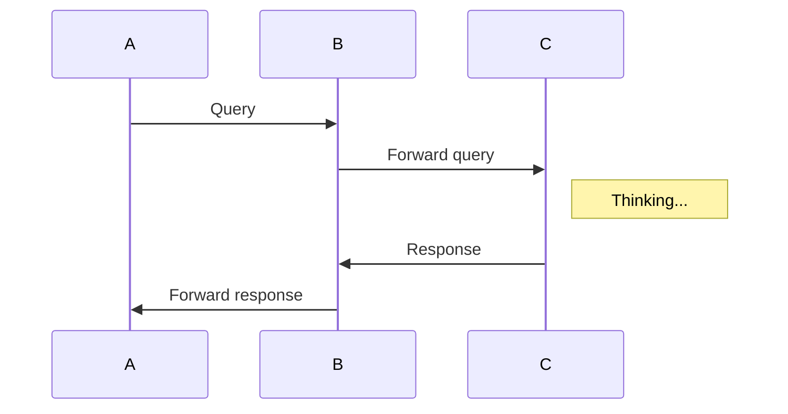

gitflow-hello-world
# GitFlow - Hello World

NOTE: Install Chrome browser extension for Mermaid diagrams from https://chrome.google.com/webstore/detail/mermaid-diagrams/phfcghedmopjadpojhmmaffjmfiakfil/related to show Mermaid diagrams

Example: Mermaid diagram

See also https://github.com/leachim6/hello-world/blob/master/j/javascript.js

This repository documents the steps to creates Minimum Viable Products (MVPs), which consists of the following:
- A feature, being a JavaScript script which logs a message: "Hello" (MVP#1)
- A new feature, being an improvement of the JavaScript script which logs a message: "Hello World" (MVP#2)
- A hotfix of the JavaScript script which logs a message: "Hello World!" (MVP#3)

We start from scratch.

